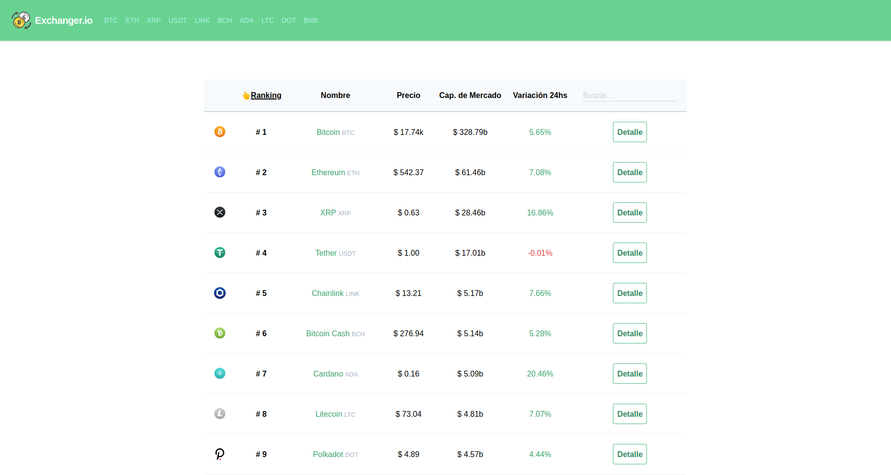
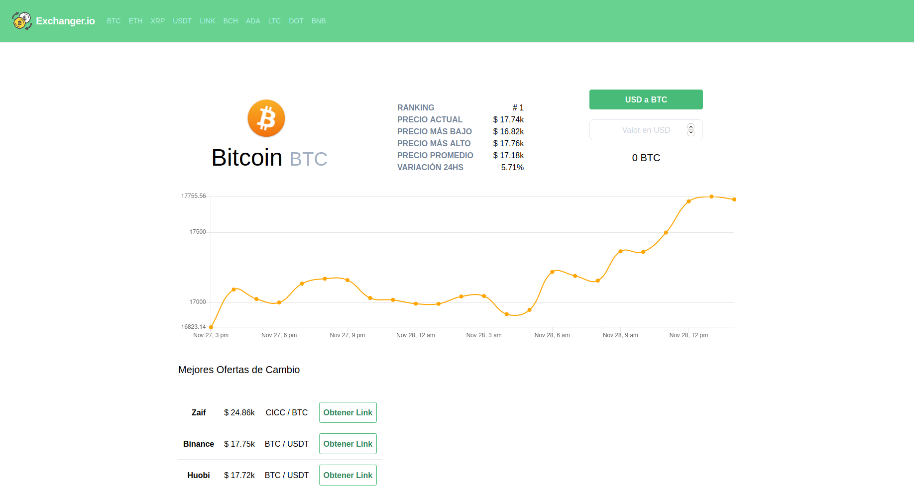

# 📌 Crypto Exchange

Application to check cryptocurrency prices and convert balances. 

## 🔨 Technologies

* Vue → (https://vuejs.org/)
* Tailwind → (https://tailwindcss.com/)

## 💻 Requirements

* node >= 12 
* npm >= 6

## 👓 Preview

You can see the project running here → [crypto-exchange](crypto-exchange.cf/).

<details>
    <summary>🖥 Desktop version </summary>

    - Home: 



    - Crypto Coin Detail: 



</details>

## 🚀 Install

### Project setup

```
npm install
```

### Compiles and hot-reloads for development

```
npm run serve
```

### Compiles and minifies for production

```
npm run build
```

### Lints and fixes files

```
npm run lint
```

## Author

👤 **Moisés Cedeño**

- Email: [moisesdavidaaron@gmail.com](mailto:moisesdavidaaron@gmail.com)
- Twitter: [@modavidc](https://twitter.com/modavidc)
- Github: [@modavidc](https://github.com/modavidc)

## 🤝 Contributing

Contributions, issues and feature requests are welcome.<br />
Feel free to check [issues page](https://github.com/modavidc/crypto-exchange/issues) if you want to contribute.<br />

## 📝 License

Copyright © 2020 [Moisés Cedeño](https://github.com/modavidc).<br />
This project is [MIT](https://github.com/kefranabg/readme-md-generator/blob/master/LICENSE) licensed.

---

_This README was generated with ❤️ by [readme-md-generator](https://github.com/kefranabg/readme-md-generator)_
